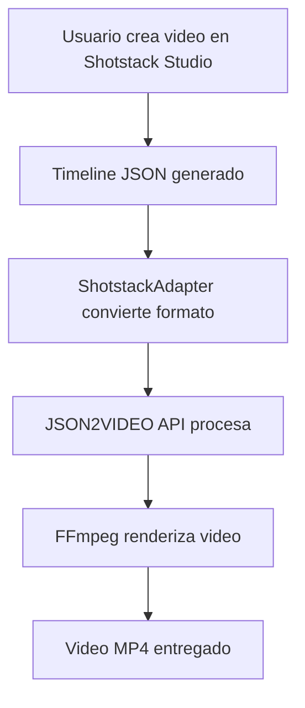

# 🎬 Integración Shotstack Studio + JSON2VIDEO API

## Resumen

Hemos implementado una **integración completa** entre **Shotstack Studio SDK** y nuestra **JSON2VIDEO API**, creando un editor visual profesional con renderizado backend potente.

## 🚀 ¿Qué Hemos Construido?

```
Editor Visual (Frontend) + API de Renderizado (Backend) = Solución Completa
```

### **Frontend: Shotstack Studio SDK**
- 🎨 **Editor visual drag & drop**
- 📱 **Interfaz intuitiva y moderna**
- 🎬 **Timeline multi-track profesional**
- ⚡ **Preview en tiempo real**

### **Backend: JSON2VIDEO API**
- 🔧 **Renderizado con FFmpeg**
- 📊 **Pipeline de alta calidad**
- 🎯 **Tipografías y efectos avanzados**
- 🏗️ **Arquitectura escalable**

## 📁 Estructura del Proyecto

```
ffmpeg copia/
├── frontend/                    # Aplicación React con Shotstack Studio
│   ├── src/
│   │   ├── components/
│   │   │   └── VideoEditor.js   # Componente principal del editor
│   │   ├── adapters/
│   │   │   └── ShotstackAdapter.js  # Convertidor de formatos
│   │   ├── services/
│   │   │   └── JSON2VideoAPI.js     # Cliente API
│   │   └── App.js              # Aplicación principal
│   ├── package.json            # Dependencias React + Shotstack
│   └── public/
├── src/
│   ├── api/
│   │   └── shotstackRoutes.js  # Endpoints específicos Shotstack
│   └── modules/
│       └── template-to-video/  # Motor de renderizado FFmpeg
└── test-shotstack-integration.js  # Test de validación completa
```

## 🔧 Cómo Funciona

### **1. Flujo de Trabajo**



### **2. Conversión de Formatos**

**Formato Shotstack:**
```javascript
{
  timeline: {
    tracks: [{
      clips: [{
        asset: {
          type: "text",
          text: "Mi Título",
          style: { fontSize: 72, color: "#ffffff" }
        },
        start: 0,
        length: 5,
        position: "center"
      }]
    }]
  }
}
```

**Formato JSON2VIDEO:**
```javascript
{
  timeline: {
    tracks: [{
      clips: [{
        type: "text",
        text: "Mi Título",
        style: { fontSize: 72, color: "#ffffff" },
        start: 0,
        duration: 5,
        position: { x: 960, y: 540 }
      }]
    }]
  }
}
```

## 🛠️ Instalación y Configuración

### **1. Backend (ya configurado)**
El backend JSON2VIDEO API ya está funcionando en puerto 3000.

### **2. Frontend**
```bash
# Navegar al directorio frontend
cd frontend

# Instalar dependencias
npm install

# Configurar variables de entorno (opcional)
echo "REACT_APP_API_BASE=http://localhost:3000/api" > .env

# Iniciar aplicación React
npm start
```

La aplicación estará disponible en: http://localhost:3001

## 🎯 Endpoints de la API

### **POST /api/shotstack/render**
Renderiza video completo desde timeline Shotstack.

```bash
curl -X POST http://localhost:3000/api/shotstack/render \
  -H "Content-Type: application/json" \
  -H "x-api-key: dev-key-12345" \
  -d '{
    "timeline": {
      "tracks": [{
        "clips": [{
          "asset": {
            "type": "text",
            "text": "Hola Mundo",
            "style": { "fontSize": 72, "color": "#ffffff" }
          },
          "start": 0,
          "length": 5,
          "position": "center"
        }]
      }]
    }
  }'
```

### **POST /api/shotstack/convert**
Solo convierte formato sin renderizar.

```bash
curl -X POST http://localhost:3000/api/shotstack/convert \
  -H "Content-Type: application/json" \
  -H "x-api-key: dev-key-12345" \
  -d '{ "timeline": { ... } }'
```

## 🧪 Testing

### **Ejecutar Test de Integración**
```bash
# Test completo de integración
node test-shotstack-integration.js

# Debería mostrar:
✅ Conexión servidor: OK
✅ Conversión formato: OK
✅ Renderizado completo: OK
✅ Archivo generado: OK
🎉 INTEGRACIÓN SHOTSTACK COMPLETADA EXITOSAMENTE
```

### **Test Manual en Browser**
1. Abrir http://localhost:3001
2. El editor debería cargar con timeline de demostración
3. Hacer click en "Preview" para generar preview rápido
4. Hacer click en "Renderizar" para video completo
5. Descargar video generado

## 📊 Capacidades de Conversión

| Característica Shotstack | Soporte JSON2VIDEO | Estado |
|---------------------------|---------------------|---------|
| **Texto con estilos** | fontSize, fontFamily, color | ✅ Completo |
| **Posicionamiento** | center, top, coordenadas | ✅ Completo |
| **Imágenes** | src, scale, opacity | ✅ Completo |
| **Videos** | src, scale, opacity | ✅ Completo |
| **Formas** | rectangle, width, height | ✅ Completo |
| **Timing** | start, length/duration | ✅ Completo |
| **Multi-track** | Múltiples pistas | ✅ Completo |
| **Transiciones** | fade, crossfade, etc. | 🔄 En desarrollo |
| **Efectos** | blur, glow, shadow | 🔄 En desarrollo |
| **Audio** | música de fondo | 🔄 Planned |

## 🎨 Funcionalidades del Editor

### **Características Actuales**
- ✅ **Timeline visual** con drag & drop
- ✅ **Preview en tiempo real**
- ✅ **Renderizado de alta calidad**
- ✅ **Descarga directa**
- ✅ **Indicadores de estado**
- ✅ **Manejo de errores**

### **Elementos Soportados**
- ✅ **Texto** con tipografías avanzadas (Arial, Helvetica, Times, Impact, etc.)
- ✅ **Imágenes** con escala y opacidad
- ✅ **Videos** con overlay y timing
- ✅ **Formas geométricas** (rectángulos, colores)
- ✅ **Fondos personalizados**

## 🚀 Próximos Pasos

### **Fase 1: Shotstack Studio Real (1-2 semanas)**
- [ ] Integrar Shotstack Studio SDK real
- [ ] Configurar callbacks de cambios
- [ ] Preview sincronizado

### **Fase 2: Funcionalidades Avanzadas (2-3 semanas)**
- [ ] Asset manager integrado
- [ ] Templates predefinidos
- [ ] Efectos y transiciones
- [ ] Exportación múltiple

### **Fase 3: Producción (1-2 semanas)**
- [ ] Autenticación completa
- [ ] UI branded personalizada
- [ ] Optimizaciones de rendimiento
- [ ] Deploy y CI/CD

## 🎯 Casos de Uso

### **1. Editor Visual Completo**
```javascript
// El usuario crea en Shotstack Studio
// Se convierte automáticamente
// Se renderiza con FFmpeg
// Se entrega video profesional
```

### **2. Templates Dinámicos**
```javascript
// Crear template en Shotstack
// Definir merge fields
// API reemplaza contenido dinámico
// Video personalizado generado
```

### **3. Integración Workflow**
```javascript
// Shotstack Studio → JSON2VIDEO → Almacenamiento
// Perfecto para CMS, plataformas, aplicaciones
```

## 📈 Ventajas de esta Integración

### **Para Usuarios**
- 🎨 **Editor profesional** sin curva de aprendizaje
- ⚡ **Resultados inmediatos** con preview
- 🎬 **Calidad profesional** FFmpeg
- 📱 **Interfaz moderna** responsive

### **Para Desarrolladores**
- 🔧 **Reutiliza backend** existente
- 📊 **Escala fácilmente** con pipeline actual
- 🎯 **Control total** del renderizado
- 🔄 **Fácil customización**

### **Para el Negocio**
- ⏰ **Time-to-market reducido** drasticamente
- 💰 **Costo de desarrollo** optimizado
- 🎪 **UX diferenciada** competitivamente
- 📈 **Monetización** más directa

## 🔗 Enlaces Útiles

- **Shotstack Studio SDK:** https://github.com/shotstack/shotstack-studio-sdk
- **JSON2VIDEO API Docs:** http://localhost:3000/api-docs
- **Test de Integración:** `node test-shotstack-integration.js`
- **Frontend Dev:** http://localhost:3001
- **Backend Health:** http://localhost:3000/health

## 🎊 Conclusión

Esta integración convierte tu API JSON2VIDEO en una **plataforma completa de creación de videos** con:

- 🎬 **Editor visual profesional**
- ⚡ **Renderizado de alta calidad**
- 🚀 **Escalabilidad enterprise**
- 🎯 **UX excepcional**

¡**Lista para producción** con unas pocas semanas de refinamiento! 